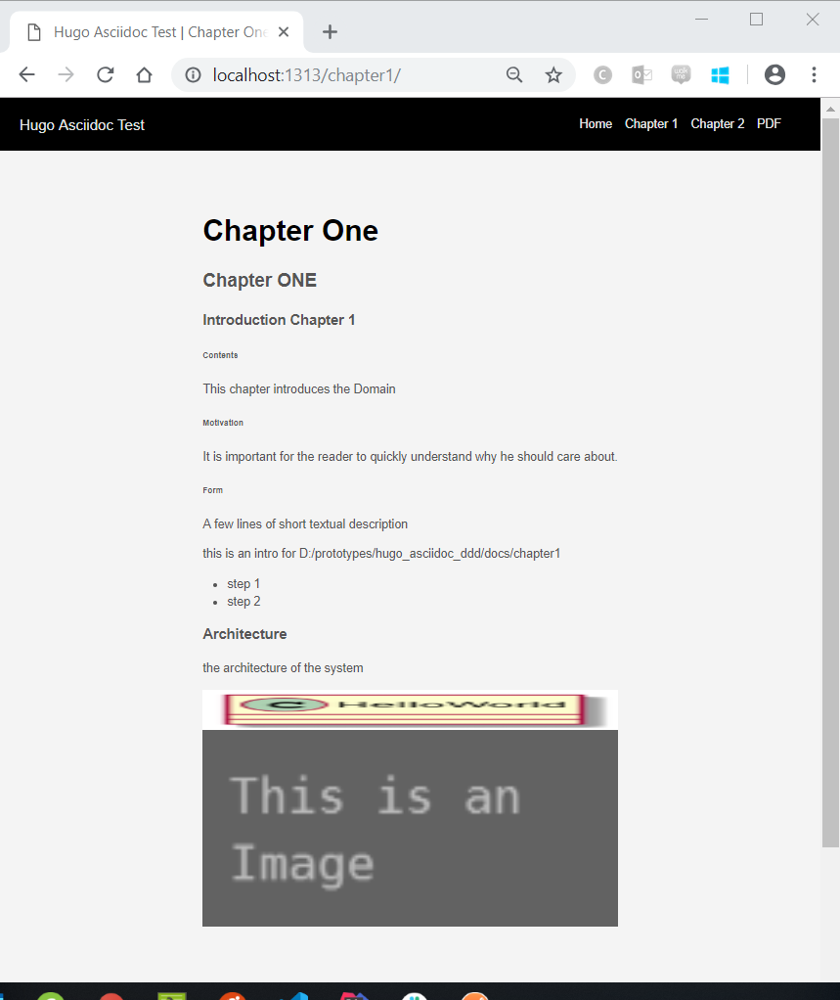

# hugo_asciidoc_ddd

This repository is just for testing gohugo issue 
https://github.com/gohugoio/hugo/issues/5695

and pull request
https://github.com/gohugoio/hugo/pull/6561

Here a Screenshot of

* Hugo
* Asciidoctor content
* usage of local Asciidoctor includes
* usage of asciidoctor-diagram 



It is required to configure new parameters in `config.toml` : 
```
[markup.asciidocext]
    args = ["--no-header-footer", "-r", "asciidoctor-html5s", "-b", "html5s", "-r", "asciidoctor-diagram"]
    workingFolderCurrent = true
```

Run Hugo with parameter `--destination`:
```
hugo -v -d ./build server
```

This repo is tested on macOS and Windows with

* asciidoctor (2.0.10, 1.5.8)
* asciidoctor-diagram (2.0.1, 1.5.12)
* asciidoctor-html5s (0.4.0)
* graphviz (2.42.3)